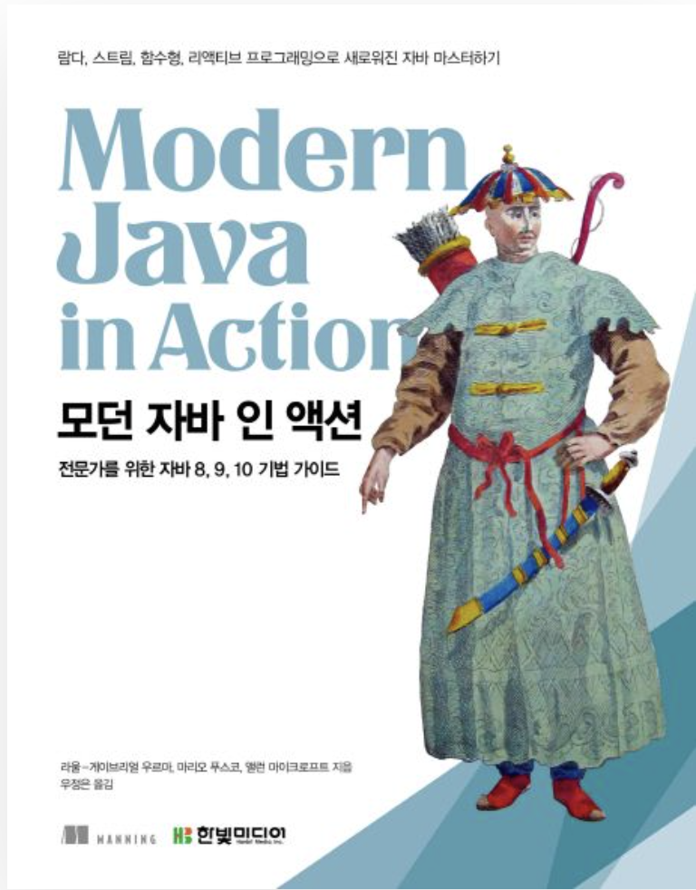

<div align="center">
  
</div>

# 📚 Modern Java in Action - 학습 노트

> Claude AI와 함께 정리한 모던 자바 인 액션 학습 저장소

[](https://github.com/dev-book-lab/modern-java-in-action)


---

## 📖 소개

이 저장소는 "Modern Java in Action" 책을 학습하면서 작성한 정리 노트입니다.

- 🤖 AI(Claude)를 활용한 심층적인 개념 설명
- 💻 실전 예제 코드
- 📝 한국어로 작성된 자세한 설명
- 🔍 "왜?"에 대한 깊이 있는 탐구

---

## 📚 목차

### Part 1: 기초
- [Chapter 01: 자바 8, 9, 10, 11 - 무슨 일이 일어나고 있는가?](./chapters/chapter01/README.md)
- [Chapter 02: 동작 파라미터화 코드 전달하기](./chapters/chapter02/README.md)
- [Chapter 03: 람다 표현식](./chapters/chapter03/README.md)

### Part 2: 함수형 데이터 처리
- [Chapter 04: 스트림 소개](./chapters/chapter04/README.md)
- [Chapter 05: 스트림 활용](./chapters/chapter05/README.md)
- [Chapter 06: 스트림으로 데이터 수집](./chapters/chapter06/README.md)
- [Chapter 07: 병렬 데이터 처리와 성능](./chapters/chapter07/README.md)

### Part 3: 스트림과 람다를 이용한 효과적 프로그래밍
- [Chapter 08: 컬렉션 API 개선](./chapters/chapter08/README.md)
- [Chapter 09: 리팩터링, 테스팅, 디버깅](./chapters/chapter09/README.md)
- [Chapter 10: 람다를 이용한 도메인 전용 언어](./chapters/chapter10/README.md)

### Part 4: 매일 자바와 함께
- [Chapter 11: null 대신 Optional 클래스](./chapters/chapter11/README.md)
- [Chapter 12: 새로운 날짜와 시간 API](./chapters/chapter12/README.md)
- [Chapter 13: 디폴트 메서드](./chapters/chapter13/README.md)

### Part 5: 개선된 자바 동시성
- [Chapter 14: 자바 모듈 시스템](./chapters/chapter14/README.md)
- [Chapter 15: CompletableFuture와 리액티브 프로그래밍 컨셉의 기초](./chapters/chapter15/README.md)
- [Chapter 16: CompletableFuture: 안정적 비동기 프로그래밍](./chapters/chapter16/README.md)
- [Chapter 17: 리액티브 프로그래밍](./chapters/chapter17/README.md)

### Part 6: 함수형 프로그래밍과 자바 진화의 미래
- [Chapter 18: 함수형 관점으로 생각하기](./chapters/chapter18/README.md)
- [Chapter 19: 함수형 프로그래밍 기법](./chapters/chapter19/README.md)
- [Chapter 20: OOP와 FP의 조화: 자바와 스칼라 비교](./chapters/chapter20/README.md)
- [Chapter 21: 결론 그리고 자바의 미래](./chapters/chapter21/README.md)

---

## 🎯 학습 방법
```
📖 Read → 🤖 AI Analysis → 💭 Deep Dive → 💻 Practice → 📝 Document
```

1. **개념 학습**: 각 Chapter의 `README.md` 읽기
2. **AI 대화**: 궁금한 점을 AI와 대화하며 해소
3. **예제 실습**: 예제 코드 실행 및 변형
4. **심화 학습**: 추가 질문과 실험을 통한 깊이 있는 이해

---

## 💻 시작하기

### 📋 필요 사항
- **Java 21** 이상
- **IntelliJ IDEA** (권장) 또는 다른 Java IDE

### 1️⃣ Repository 클론
```bash
git clone https://github.com/dev-book-lab/modern-java-in-action.git
cd modern-java-in-action
```

### 2️⃣ IntelliJ에서 열기
```
File → Open → modern-java-in-action 폴더 선택
```

프로젝트가 자동으로 Gradle 프로젝트로 인식되고, 의존성이 다운로드됩니다.

### 3️⃣ 예제 실행

각 챕터의 예제 코드를 실행하려면:

1. `chapters/chapter01/examples/FilteringApples.java` 파일 열기
2. `main()` 메서드 좌측의 **▶️ 실행 버튼** 클릭
3. 또는 **우측 상단의 실행 버튼** 클릭

> 💡 **Tip**: 각 예제는 독립적으로 실행 가능하며, IntelliJ에서 바로 실행할 수 있습니다.

---

## 📝 작성 방식

- ✅ 책 내용 요약 + AI를 통한 심층 분석
- ✅ 실무 관점의 추가 설명
- ✅ "왜?"에 대한 질문과 답변
- ✅ 코드 예제와 상세한 주석
- ✅ 다이어그램과 시각 자료

---

## 🤝 기여 방법

1. Fork the repository
2. Create your feature branch (`git checkout -b feature/AmazingFeature`)
3. Commit your changes (`git commit -m 'Add some AmazingFeature'`)
4. Push to the branch (`git push origin feature/AmazingFeature`)
5. Open a Pull Request

---

## 🙏 Reference

- [Modern Java in Action](https://www.manning.com/books/modern-java-in-action) - Manning Publications

---

## ✨ Author

AI와 대화하며 기술을 깊이 이해하는 개발자의 학습 기록

---

<div align="center">

**⭐️ 도움이 되셨다면 Star를 눌러주세요!**

Made with ❤️ and 🤖

</div>
