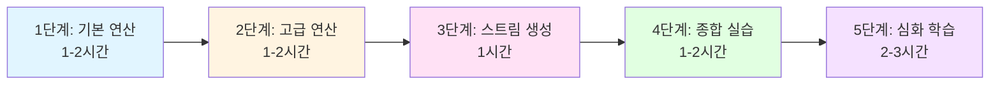

<div align="center">

# Chapter 05: 스트림 활용 🌊

**"필터링, 슬라이싱, 매핑, 검색, 매칭, 리듀싱으로 데이터를 처리하는 강력한 API"**

> *컬렉션 데이터를 선언적으로 처리하고, 복잡한 데이터 쿼리를 간결하게 표현하는 기능*

[📖 Deep Dive](advanced/deep-dive.md) | [💻 Code](code/) | [📋 CheatSheet](advanced/cheatsheet.md) | [💬 Q&A](advanced/qa-sessions.md)

</div>

---

## 📚 목차

1. [학습 목표](#-학습-목표)
2. [핵심 개념](#-핵심-개념)
3. [실습 코드](#-실습-코드)
4. [심화 학습](#-심화-학습)
5. [학습 로드맵](#-학습-로드맵)
6. [주요 포인트](#-주요-포인트)
7. [실무 활용](#-실무-활용)

---

## 🎯 학습 목표

이 챕터에서는 **스트림 API의 강력한 연산들**을 마스터합니다:

<table>
<tr>
<td width="50%">

### 📊 데이터 처리 연산
- ✅ **필터링과 슬라이싱** - 데이터 선택과 제한
- ✅ **매핑** - 데이터 변환과 평면화
- ✅ **검색과 매칭** - 조건 검사와 요소 찾기

</td>
<td width="50%">

### 🔢 집계와 생성
- ✅ **리듀싱** - 모든 데이터를 하나의 값으로
- ✅ **기본형 특화 스트림** - 박싱 비용 제거
- ✅ **스트림 생성** - 다양한 소스에서 생성

</td>
</tr>
</table>

---

## 🎯 핵심 개념

### 1️⃣ 필터링과 슬라이싱

<details open>
<summary><b>프레디케이트 필터링</b></summary>

```java
// filter - 조건에 맞는 요소만 선택
List<Dish> vegetarianMenu = menu.stream()
    .filter(Dish::isVegetarian)
    .collect(toList());

// distinct - 중복 제거
numbers.stream()
    .filter(i -> i % 2 == 0)
    .distinct()
    .forEach(System.out::println);
```

</details>

<details>
<summary><b>스트림 슬라이싱 (Java 9+)</b></summary>

```java
// takeWhile - 조건이 false가 될 때까지
specialMenu.stream()
    .takeWhile(dish -> dish.getCalories() < 320)
    .collect(toList());

// dropWhile - 조건이 false가 될 때부터
specialMenu.stream()
    .dropWhile(dish -> dish.getCalories() < 320)
    .collect(toList());
```

**💡 Tip**: `filter`는 전체 검사, `takeWhile`은 정렬된 데이터에서 조기 종료!

</details>

<details>
<summary><b>스트림 축소와 건너뛰기</b></summary>

```java
// limit - 처음 n개만
menu.stream()
    .filter(d -> d.getCalories() > 300)
    .limit(3)
    .collect(toList());

// skip - 처음 n개 제외
menu.stream()
    .filter(d -> d.getCalories() > 300)
    .skip(2)
    .collect(toList());
```

</details>

---

### 2️⃣ 매핑

<details open>
<summary><b>map - 각 요소 변환</b></summary>

```java
// 요리명 추출
List<String> dishNames = menu.stream()
    .map(Dish::getName)
    .collect(toList());

// 문자열 길이
List<Integer> wordLengths = words.stream()
    .map(String::length)
    .collect(toList());
```

</details>

<details>
<summary><b>flatMap - 스트림 평면화</b></summary>

```java
// ["Hello", "World"] → ["H", "e", "l", "o", "W", "r", "d"]
List<String> uniqueCharacters = words.stream()
    .map(word -> word.split(""))        // Stream<String[]>
    .flatMap(Arrays::stream)             // Stream<String> (평면화!)
    .distinct()
    .collect(toList());
```

**💡 핵심**: `map`은 1:1 변환, `flatMap`은 1:N 변환 후 평면화!

</details>

---

### 3️⃣ 검색과 매칭

<details open>
<summary><b>매칭 연산 (anyMatch, allMatch, noneMatch)</b></summary>

```java
// anyMatch - 하나라도 일치?
boolean hasVegetarian = menu.stream()
    .anyMatch(Dish::isVegetarian);

// allMatch - 모두 일치?
boolean isHealthy = menu.stream()
    .allMatch(dish -> dish.getCalories() < 1000);

// noneMatch - 모두 불일치?
boolean isHealthy = menu.stream()
    .noneMatch(dish -> dish.getCalories() >= 1000);
```

**⚡ 쇼트서킷**: 조건 만족하면 즉시 종료!

</details>

<details>
<summary><b>요소 검색 (findAny, findFirst)</b></summary>

```java
// findAny - 임의의 요소
Optional<Dish> dish = menu.stream()
    .filter(Dish::isVegetarian)
    .findAny();

// findFirst - 첫 번째 요소
Optional<Integer> firstSquare = numbers.stream()
    .map(n -> n * n)
    .filter(n -> n % 3 == 0)
    .findFirst();
```

**병렬 스트림**: 순서 무관하면 `findAny`가 더 빠름!

</details>

---

### 4️⃣ 리듀싱

<details open>
<summary><b>reduce 기본</b></summary>

```java
// 합계
int sum = numbers.stream()
    .reduce(0, Integer::sum);

// 최대값
Optional<Integer> max = numbers.stream()
    .reduce(Integer::max);

// 최소값
Optional<Integer> min = numbers.stream()
    .reduce(Integer::min);
```

**동작 원리**:
```
numbers = [1, 2, 3, 4, 5]
reduce(0, Integer::sum)

0 + 1 = 1
1 + 2 = 3
3 + 3 = 6
6 + 4 = 10
10 + 5 = 15 ✅
```

</details>

<details>
<summary><b>reduce 형태</b></summary>

| 형태 | 반환 타입 | 빈 스트림 |
|------|----------|----------|
| `reduce(초기값, f)` | `T` | 초기값 반환 |
| `reduce(f)` | `Optional<T>` | `Optional.empty()` |

</details>

---

### 5️⃣ 기본형 특화 스트림

<details open>
<summary><b>박싱 비용 제거</b></summary>

```java
// ❌ 비효율 - 박싱/언박싱 발생
int calories = menu.stream()
    .map(Dish::getCalories)  // Stream<Integer>
    .reduce(0, Integer::sum);

// ✅ 효율 - IntStream 사용
int calories = menu.stream()
    .mapToInt(Dish::getCalories)  // IntStream
    .sum();
```

**성능 차이**: 약 3~5배!

</details>

<details>
<summary><b>기본형 스트림 종류</b></summary>

| 스트림 | 타입 | 전용 메서드 |
|--------|------|------------|
| `IntStream` | int | sum, average, max, min |
| `LongStream` | long | sum, average, max, min |
| `DoubleStream` | double | sum, average, max, min |

**변환**:
```java
// 일반 → 기본형
IntStream intStream = stream.mapToInt(...)

// 기본형 → 일반
Stream<Integer> stream = intStream.boxed()

// 기본형 간 변환
LongStream longStream = intStream.asLongStream()
```

</details>

<details>
<summary><b>숫자 범위</b></summary>

```java
// range - 끝 제외 [1, 100)
IntStream.range(1, 100)
    .filter(n -> n % 2 == 0)
    .forEach(System.out::println);

// rangeClosed - 끝 포함 [1, 100]
IntStream.rangeClosed(1, 100)
    .filter(n -> n % 2 == 0)
    .count();  // 50
```

</details>

---

### 6️⃣ 스트림 생성

<details open>
<summary><b>다양한 생성 방법</b></summary>

```java
// 값으로 생성
Stream<String> stream = Stream.of("Java", "Python", "JavaScript");

// 빈 스트림
Stream<String> empty = Stream.empty();

// null 안전 생성 (Java 9+)
Stream<String> stream = Stream.ofNullable(System.getProperty("home"));

// 배열로 생성
int[] numbers = {2, 3, 5, 7, 11, 13};
IntStream stream = Arrays.stream(numbers);

// 파일로 생성
try (Stream<String> lines = Files.lines(Paths.get("data.txt"))) {
    long uniqueWords = lines
        .flatMap(line -> Arrays.stream(line.split(" ")))
        .distinct()
        .count();
}
```

</details>

<details>
<summary><b>무한 스트림</b></summary>

```java
// iterate - 순차 생성 (이전 값 기반)
Stream.iterate(0, n -> n + 2)
    .limit(10)
    .forEach(System.out::println);  // 0, 2, 4, 6, 8, ...

// iterate with predicate (Java 9+)
Stream.iterate(0, n -> n < 100, n -> n + 2)
    .forEach(System.out::println);

// generate - 독립 생성 (랜덤)
Stream.generate(Math::random)
    .limit(5)
    .forEach(System.out::println);

// 피보나치 수열
Stream.iterate(new int[]{0, 1},
        t -> new int[]{t[1], t[0] + t[1]})
    .limit(10)
    .map(t -> t[0])
    .forEach(System.out::println);
```

**⚠️ 주의**: 무한 스트림에는 반드시 `limit` 필요!

</details>

---

## 💻 실습 코드

### 📁 기본 예제

| 파일 | 주제 | 핵심 내용 |
|------|------|----------|
| **[Filtering.java](code/Filtering.java)** | 필터링과 슬라이싱 | filter, distinct, takeWhile, dropWhile, limit, skip |
| **[Mapping.java](code/Mapping.java)** | 매핑과 평면화 | map, flatMap, 숫자쌍 생성 |
| **[Finding.java](code/Finding.java)** | 검색과 매칭 | anyMatch, allMatch, noneMatch, findAny, findFirst |
| **[Reducing.java](code/Reducing.java)** | 리듀싱 | reduce로 합계/최대/최소, 초기값 있음/없음 |
| **[NumericStreams.java](code/NumericStreams.java)** | 기본형 특화 스트림 | mapToInt, boxed, range, 피타고라스 수 |
| **[BuildingStreams.java](code/BuildingStreams.java)** | 스트림 생성 | of, empty, Arrays.stream, Files.lines, iterate, generate |
| **[Laziness.java](code/Laziness.java)** | 지연 평가 | 스트림의 지연 실행, 쇼트서킷 효과 |

### 📁 종합 예제

| 파일 | 설명 |
|------|------|
| **[PuttingIntoPractice.java](code/PuttingIntoPractice.java)** | 거래자와 거래 데이터 처리 실전 예제 |

---

## 📖 심화 학습

<table>
<tr>
<td width="33%">

### [📘 Deep Dive](advanced/deep-dive.md)
**상세 개념 설명**

- 필터링과 슬라이싱 완전 분석
- 매핑과 평면화 심화
- 검색과 매칭의 내부 동작
- 리듀싱 패턴과 응용
- 기본형 특화 스트림의 필요성
- 무한 스트림의 활용

</td>
<td width="33%">

### [📝 CheatSheet](advanced/cheatsheet.md)
**핵심 요약**

- 주요 연산 비교표
- 자주 쓰는 패턴
- 성능 최적화 팁
- 흔한 실수
- 빠른 참조용 표

</td>
<td width="33%">

### [❓ Q&A Sessions](advanced/qa-sessions.md)
**자주 묻는 질문 20개**

- filter vs takeWhile
- map vs flatMap
- findAny vs findFirst
- reduce 초기값 설정
- 무한 스트림 안전하게 사용
- 성능 최적화

</td>
</tr>
</table>

---

## 🗺️ 학습 로드맵



### 📚 단계별 상세

<details open>
<summary><b>1단계: 기본 연산 마스터 (1-2시간)</b></summary>

**학습 순서**:
1. `Filtering.java` - 필터링의 모든 것
2. `Mapping.java` - 데이터 변환
3. `Finding.java` - 검색과 매칭

**목표**: filter, map, anyMatch 등 기본 연산 이해

</details>

<details>
<summary><b>2단계: 고급 연산 (1-2시간)</b></summary>

**학습 순서**:
1. `Reducing.java` - 데이터 축약
2. `NumericStreams.java` - 성능 최적화

**목표**: reduce와 기본형 스트림 활용

</details>

<details>
<summary><b>3단계: 스트림 생성 (1시간)</b></summary>

**학습 순서**:
1. `BuildingStreams.java` - 다양한 생성 방법
2. `Laziness.java` - 지연 평가 이해

**목표**: 스트림 생성과 동작 원리 파악

</details>

<details>
<summary><b>4단계: 종합 실습 (1-2시간)</b></summary>

**학습 순서**:
1. `PuttingIntoPractice.java` - 실전 예제

**목표**: 모든 연산을 종합하여 실무 문제 해결

</details>

<details>
<summary><b>5단계: 심화 학습 (2-3시간)</b></summary>

**학습 순서**:
1. `deep-dive.md` - 개념 심화
2. `qa-sessions.md` - 궁금증 해소
3. `cheatsheet.md` - 복습 및 정리

**목표**: 완벽한 이해와 실무 적용 능력

</details>

---

## 🔥 주요 포인트

### 📊 스트림 연산 분류

<table>
<tr>
<td width="50%">

#### 중간 연산 (Intermediate)

**반환**: `Stream<T>`

| 상태 | 연산 |
|------|------|
| **무상태** | filter, map, flatMap, mapToXxx |
| **상태 있음** | distinct, sorted, limit, skip |

</td>
<td width="50%">

#### 최종 연산 (Terminal)

**반환**: `void`, `boolean`, `Optional<T>`, `Collection`

| 쇼트서킷 | 비쇼트서킷 |
|---------|-----------|
| anyMatch, allMatch, noneMatch | forEach, collect |
| findAny, findFirst, limit | reduce, count |

</td>
</tr>
</table>

### ⚡ 쇼트서킷 연산

**조기 종료 가능한 연산**:
- `anyMatch`, `allMatch`, `noneMatch` - 조건 확인 즉시 종료
- `findAny`, `findFirst` - 요소 찾으면 즉시 종료
- `limit` - n개 찾으면 즉시 종료

```java
// 예제: 채식 요리 1개만 찾으면 종료
Optional<Dish> dish = menu.stream()
    .filter(Dish::isVegetarian)
    .findAny();  // 찾는 즉시 종료!
```

---

## 💡 실무 활용

### 🎯 실전 패턴

<details open>
<summary><b>1. 데이터 필터링과 변환</b></summary>

```java
// 고칼로리 요리명 추출 (상위 3개)
List<String> highCalorieDishNames = menu.stream()
    .filter(dish -> dish.getCalories() > 300)
    .map(Dish::getName)
    .limit(3)
    .collect(toList());
```

</details>

<details>
<summary><b>2. 복잡한 조건 검증</b></summary>

```java
// 모든 주문이 유효한지 검증
boolean isValidOrder = orders.stream()
    .allMatch(order -> 
        order.getAmount() > 0 && 
        order.getStatus() == CONFIRMED
    );
```

</details>

<details>
<summary><b>3. 데이터 집계</b></summary>

```java
// 총 칼로리 계산
int totalCalories = menu.stream()
    .mapToInt(Dish::getCalories)
    .sum();

// 최대 칼로리
OptionalInt maxCalories = menu.stream()
    .mapToInt(Dish::getCalories)
    .max();
```

</details>

<details>
<summary><b>4. 데이터 변환과 평면화</b></summary>

```java
// 문자 추출 및 중복 제거
List<String> uniqueCharacters = words.stream()
    .flatMap(word -> Arrays.stream(word.split("")))
    .distinct()
    .collect(toList());
```

</details>

<details>
<summary><b>5. 조건부 처리 (Optional)</b></summary>

```java
// 채식 요리 찾아서 처리
menu.stream()
    .filter(Dish::isVegetarian)
    .findAny()
    .ifPresent(dish -> 
        System.out.println("Found: " + dish.getName())
    );
```

</details>

---

## ⚠️ 주의사항

### 🚨 반드시 기억할 것

<table>
<tr>
<td width="50%">

#### ❌ 하지 말아야 할 것

```java
// 1. 스트림 재사용
Stream<String> stream = list.stream();
stream.forEach(System.out::println);
stream.forEach(...);  // IllegalStateException!

// 2. 무한 스트림에 limit 없음
Stream.iterate(0, n -> n + 1)
    .forEach(System.out::println);  // 무한 루프!

// 3. 파일 스트림 close 안 함
Stream<String> lines = Files.lines(path);
lines.forEach(System.out::println);
// 리소스 누수!

// 4. 박싱 비용 무시
int sum = list.stream()
    .reduce(0, Integer::sum);  // 비효율!
```

</td>
<td width="50%">

#### ✅ 올바른 방법

```java
// 1. 매번 새로 생성
list.stream().forEach(System.out::println);
list.stream().forEach(...);  // OK

// 2. limit 필수
Stream.iterate(0, n -> n + 1)
    .limit(10)
    .forEach(System.out::println);  // OK

// 3. try-with-resources
try (Stream<String> lines = Files.lines(path)) {
    lines.forEach(System.out::println);
}  // 자동 close

// 4. 기본형 스트림
int sum = list.stream()
    .mapToInt(Integer::intValue)
    .sum();  // 효율적!
```

</td>
</tr>
</table>

---

## 🚀 성능 최적화

### ⚡ 최적화 원칙

1. **filter 먼저 배치** - 데이터를 먼저 줄이자
   ```java
   stream.filter(...).map(...).sorted()  // ✅ 좋음
   stream.sorted().filter(...).map(...)  // ❌ 나쁨
   ```

2. **기본형 스트림 사용** - 박싱 비용 제거 (3~5배 빠름)
   ```java
   stream.mapToInt(...).sum()  // ✅ 빠름
   stream.map(...).reduce(0, Integer::sum)  // ❌ 느림
   ```

3. **limit 활용** - 조기 종료
   ```java
   stream.filter(...).limit(10).collect(toList())  // ✅ 10개만 처리
   ```

4. **쇼트서킷 연산 활용** - 전체 검사 피하기
   ```java
   stream.anyMatch(...)  // ✅ 찾으면 즉시 종료
   stream.filter(...).count() > 0  // ❌ 전체 검사
   ```

5. **병렬 스트림 신중히** - 작은 데이터는 오히려 느림
   ```java
   bigList.parallelStream()...  // ✅ 대용량 데이터
   smallList.parallelStream()...  // ❌ 오버헤드 더 큼
   ```

---

## 📚 참고 자료

- **Modern Java in Action** - Chapter 5
- [Java Stream API 공식 문서](https://docs.oracle.com/javase/8/docs/api/java/util/stream/Stream.html)
- [Baeldung - Java 8 Streams](https://www.baeldung.com/java-8-streams)
- [Oracle Tutorials - Processing Data with Java SE 8 Streams](https://www.oracle.com/technical-resources/articles/java/ma14-java-se-8-streams.html)

---

## ✅ 학습 체크리스트

### 기본 (필수)
- [ ] filter로 데이터 필터링
- [ ] map으로 데이터 변환
- [ ] distinct로 중복 제거
- [ ] limit/skip으로 데이터 제한
- [ ] anyMatch로 조건 검사
- [ ] reduce로 데이터 집계

### 중급 (권장)
- [ ] flatMap으로 평면화
- [ ] takeWhile/dropWhile 활용 (Java 9+)
- [ ] allMatch/noneMatch 이해
- [ ] Optional 올바르게 처리
- [ ] 기본형 스트림 사용

### 고급 (심화)
- [ ] 무한 스트림 안전하게 사용
- [ ] 쇼트서킷 연산 이해
- [ ] 성능 최적화 적용
- [ ] 상태 있음/없음 구분
- [ ] 지연 평가 원리 이해

---

## 🎓 다음 단계

<div align="center">

### 챕터 5를 완료하셨나요? 축하합니다! 🎉

**다음 학습 추천**:

**Chapter 6: 스트림으로 데이터 수집**
- Collectors 활용
- 그룹화와 분할
- 커스텀 컬렉터 작성

[➡️ Chapter 6으로 이동](../chapter06/)

</div>

---

<div align="center">

**📅 마지막 업데이트**: 2024년 12월  
**📊 난이도**: ⭐⭐⭐ (중급)  
**⏱️ 예상 학습 시간**: 6-8시간  
**✍️ 작성자**: Modern Java in Action Study

---

**🌟 이 자료가 도움이 되셨다면 Star를 눌러주세요!**

</div>
