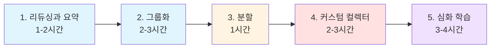

<div align="center">

# Chapter 06: 스트림으로 데이터 수집 📊

**"Collector로 데이터를 그룹화하고, 분할하고, 리듀싱하는 강력한 수집 연산"**

> *collect()를 마스터하여 복잡한 데이터 집계와 변환을 선언적으로 처리하는 기술*

[📖 Deep Dive](advanced/deep-dive.md) | [💻 Code](code/) | [📋 CheatSheet](advanced/cheatsheet.md) | [💬 Q&A](advanced/qa-sessions.md)

</div>

---

## 📚 목차

1. [학습 목표](#-학습-목표)
2. [핵심 개념](#-핵심-개념)
3. [실습 코드](#-실습-코드)
4. [심화 학습](#-심화-학습)
5. [학습 로드맵](#-학습-로드맵)
6. [주요 포인트](#-주요-포인트)
7. [실무 활용](#-실무-활용)

---

## 🎯 학습 목표

이 챕터에서는 **스트림의 최종 연산 collect()** 를 마스터합니다:

<table>
<tr>
<td width="50%">

### 📊 데이터 수집 연산
- ✅ **리듀싱과 요약** - 데이터를 하나의 값으로
- ✅ **그룹화** - 특정 기준으로 데이터 분류
- ✅ **분할** - Boolean 기준으로 데이터 분할

</td>
<td width="50%">

### 🔧 고급 수집 기법
- ✅ **Collector 인터페이스** - 커스텀 컬렉터 구현
- ✅ **다수준 그룹화** - 중첩된 그룹화 구조
- ✅ **성능 최적화** - 효율적인 데이터 처리

</td>
</tr>
</table>

---

## 💡 핵심 개념

### 1️⃣ 리듀싱과 요약

**기본 집계 연산:**
```java
// 개수 세기
long count = menu.stream().collect(counting());

// 최대값/최소값
Optional<Dish> mostCalorieDish = menu.stream()
    .collect(maxBy(comparingInt(Dish::getCalories)));

// 합계와 평균
int totalCalories = menu.stream()
    .collect(summingInt(Dish::getCalories));

double avgCalories = menu.stream()
    .collect(averagingInt(Dish::getCalories));
```

**통계 정보 한 번에:**
```java
IntSummaryStatistics menuStatistics = menu.stream()
    .collect(summarizingInt(Dish::getCalories));
// count, sum, min, max, average 모두 포함!
```

**문자열 연결:**
```java
String shortMenu = menu.stream()
    .map(Dish::getName)
    .collect(joining(", "));
```

**범용 reducing:**
```java
// 세 개의 인수
int totalCalories = menu.stream()
    .collect(reducing(
        0,                      // 초기값
        Dish::getCalories,      // 변환 함수
        Integer::sum            // BinaryOperator
    ));

// 한 개의 인수
Optional<Dish> mostCalorieDish = menu.stream()
    .collect(reducing(
        (d1, d2) -> d1.getCalories() > d2.getCalories() ? d1 : d2
    ));
```

---

### 2️⃣ 그룹화 (groupingBy)

**기본 그룹화:**
```java
Map<Dish.Type, List<Dish>> dishesByType = menu.stream()
    .collect(groupingBy(Dish::getType));
```

**복잡한 분류 기준:**
```java
public enum CaloricLevel { DIET, NORMAL, FAT }

Map<CaloricLevel, List<Dish>> dishesByCaloricLevel = menu.stream()
    .collect(groupingBy(dish -> {
        if (dish.getCalories() <= 400) return CaloricLevel.DIET;
        else if (dish.getCalories() <= 700) return CaloricLevel.NORMAL;
        else return CaloricLevel.FAT;
    }));
```

**다운스트림 컬렉터:**
```java
// 그룹별 개수
Map<Dish.Type, Long> typesCount = menu.stream()
    .collect(groupingBy(Dish::getType, counting()));

// 그룹별 최대값
Map<Dish.Type, Optional<Dish>> mostCaloricByType = menu.stream()
    .collect(groupingBy(
        Dish::getType,
        maxBy(comparingInt(Dish::getCalories))
    ));
```

**필터링, 매핑, 평면화:**
```java
// filtering - 모든 키 유지
Map<Dish.Type, List<Dish>> caloricDishesByType = menu.stream()
    .collect(groupingBy(
        Dish::getType,
        filtering(dish -> dish.getCalories() > 500, toList())
    ));

// mapping - 그룹 내 변환
Map<Dish.Type, List<String>> dishNamesByType = menu.stream()
    .collect(groupingBy(
        Dish::getType,
        mapping(Dish::getName, toList())
    ));

// flatMapping - 그룹 내 평면화
Map<Dish.Type, Set<String>> dishTagsByType = menu.stream()
    .collect(groupingBy(
        Dish::getType,
        flatMapping(dish -> dishTags.get(dish.getName()).stream(), toSet())
    ));
```

---

### 3️⃣ 다수준 그룹화

**2단계 그룹화:**
```java
Map<Dish.Type, Map<CaloricLevel, List<Dish>>> dishesByTypeCaloricLevel = 
    menu.stream()
        .collect(groupingBy(
            Dish::getType,                    // 1차 분류
            groupingBy(dish -> {              // 2차 분류
                if (dish.getCalories() <= 400) return CaloricLevel.DIET;
                else if (dish.getCalories() <= 700) return CaloricLevel.NORMAL;
                else return CaloricLevel.FAT;
            })
        ));
```

---

### 4️⃣ collectingAndThen

**Optional 제거:**
```java
Map<Dish.Type, Dish> mostCaloricByType = menu.stream()
    .collect(groupingBy(
        Dish::getType,
        collectingAndThen(
            maxBy(comparingInt(Dish::getCalories)),
            Optional::get  // Optional 벗기기
        )
    ));
```

---

### 5️⃣ 분할 (partitioningBy)

**기본 분할:**
```java
Map<Boolean, List<Dish>> partitionedMenu = menu.stream()
    .collect(partitioningBy(Dish::isVegetarian));
```

**다운스트림 컬렉터와 함께:**
```java
Map<Boolean, Map<Dish.Type, List<Dish>>> vegetarianDishesByType = 
    menu.stream()
        .collect(partitioningBy(
            Dish::isVegetarian,
            groupingBy(Dish::getType)
        ));

Map<Boolean, Dish> mostCaloricPartitionedByVegetarian = menu.stream()
    .collect(partitioningBy(
        Dish::isVegetarian,
        collectingAndThen(
            maxBy(comparingInt(Dish::getCalories)),
            Optional::get
        )
    ));
```

---

### 6️⃣ Collector 인터페이스

**5가지 메서드:**
```java
public interface Collector<T, A, R> {
    Supplier<A> supplier();           // 컨테이너 생성
    BiConsumer<A, T> accumulator();   // 요소 추가
    BinaryOperator<A> combiner();     // 병합 (병렬용)
    Function<A, R> finisher();        // 최종 변환
    Set<Characteristics> characteristics();  // 특성
}
```

**ToListCollector 구현:**
```java
public class ToListCollector<T> implements Collector<T, List<T>, List<T>> {
    
    @Override
    public Supplier<List<T>> supplier() {
        return ArrayList::new;
    }
    
    @Override
    public BiConsumer<List<T>, T> accumulator() {
        return List::add;
    }
    
    @Override
    public BinaryOperator<List<T>> combiner() {
        return (list1, list2) -> {
            list1.addAll(list2);
            return list1;
        };
    }
    
    @Override
    public Function<List<T>, List<T>> finisher() {
        return Function.identity();
    }
    
    @Override
    public Set<Characteristics> characteristics() {
        return EnumSet.of(IDENTITY_FINISH, CONCURRENT);
    }
}
```

---

### 7️⃣ collect() vs reduce()

| 특성 | collect() | reduce() |
|------|-----------|----------|
| **목적** | 가변 컨테이너에 수집 | 두 값을 하나로 결합 |
| **방식** | 가변(Mutable) | 불변(Immutable) |
| **병렬 처리** | 안전하고 효율적 | 동기화 필요 |
| **사용 사례** | List, Set, Map 생성 | 숫자 합계, 최대/최소 |

```java
// ✅ collect - 컬렉션 생성
List<Integer> numbers = stream.collect(toList());

// ✅ reduce - 단일 값 계산
int sum = stream.reduce(0, Integer::sum);

// ❌ reduce로 리스트 만들기 (최악!)
List<Integer> numbers = stream.reduce(
    new ArrayList<>(),
    (list, elem) -> { list.add(elem); return list; },
    (list1, list2) -> { list1.addAll(list2); return list1; }
);
```

---

## 💻 실습 코드

### 📁 기본 예제

<table>
<tr>
<td width="50%">

**1. [Summarizing.java](code/Summarizing.java)**
- counting, maxBy, minBy
- summingInt, averagingInt
- summarizingInt
- joining

**2. [Grouping.java](code/Grouping.java)**
- groupingBy 기본
- 다수준 그룹화
- filtering, mapping, flatMapping

**3. [Partitioning.java](code/Partitioning.java)**
- partitioningBy 기본
- 다운스트림 컬렉터
- collectingAndThen

**4. [GroupingTransactions.java](code/GroupingTransactions.java)**
- 명령형 vs 함수형
- 통화별 그룹화

</td>
<td width="50%">

**5. [Reducing.java](code/Reducing.java)**
- 세 인수 reducing
- 한 인수 reducing
- 다양한 방법 비교

**6. [ToListCollector.java](code/ToListCollector.java)**
- Collector 인터페이스 구현
- 5가지 메서드 구현

**7. [PartitionPrimeNumbers.java](code/PartitionPrimeNumbers.java)**
- 기본 방법 vs 최적화
- 커스텀 컬렉터 (8.5배 빠름!)

**8. [CollectorHarness.java](code/CollectorHarness.java)**
- 성능 측정
- 벤치마크

</td>
</tr>
</table>

---

## 📖 심화 학습

<table>
<tr>
<td width="33%">

### 📘 [Deep Dive](advanced/deep-dive.md)

**완전 분석:**
- Collector 인터페이스
- 순차/병렬 리듀싱
- groupingBy 내부 동작
- 커스텀 컬렉터 구현
- 성능 최적화 기법

</td>
<td width="33%">

### 📝 [Cheat Sheet](advanced/cheatsheet.md)

**빠른 참조:**
- Collectors 메서드 전체
- 그룹화 패턴 10가지
- collect vs reduce
- 자주 쓰는 조합
- 성능 최적화 체크리스트

</td>
<td width="33%">

### ❓ [Q&A](advanced/qa-sessions.md)

**15개 FAQ:**
- collect vs reduce?
- groupingBy 2인수 vs 3인수?
- partitioningBy vs groupingBy?
- Characteristics는?
- 커스텀 컬렉터 언제?

</td>
</tr>
</table>

---

## 🗺️ 학습 로드맵



### 📅 학습 단계 (총 8-12시간)

<details>
<summary><b>1단계: 리듀싱과 요약 (1-2시간)</b></summary>

**학습 내용:**
- `Summarizing.java` 실습
- `Reducing.java` 실습
- counting, summing, averaging
- joining, reducing

**체크포인트:**
- [ ] summingInt로 합계 계산
- [ ] maxBy로 최대값 찾기
- [ ] joining으로 문자열 연결
- [ ] reducing의 세 인수 이해

</details>

<details>
<summary><b>2단계: 그룹화 (2-3시간)</b></summary>

**학습 내용:**
- `Grouping.java` 실습
- `GroupingTransactions.java` 실습
- 기본 그룹화
- 다수준 그룹화
- filtering, mapping, flatMapping

**체크포인트:**
- [ ] groupingBy로 타입별 그룹화
- [ ] 다운스트림 컬렉터 활용
- [ ] 2단계 그룹화 구현
- [ ] filtering으로 키 유지

</details>

<details>
<summary><b>3단계: 분할 (1시간)</b></summary>

**학습 내용:**
- `Partitioning.java` 실습
- partitioningBy 기본
- 다운스트림 컬렉터
- collectingAndThen

**체크포인트:**
- [ ] Boolean 기준 분할
- [ ] 분할 + 그룹화 조합
- [ ] Optional 제거 방법
- [ ] partitioningBy vs groupingBy

</details>

<details>
<summary><b>4단계: 커스텀 컬렉터 (2-3시간)</b></summary>

**학습 내용:**
- `ToListCollector.java` 실습
- `PartitionPrimeNumbers.java` 실습
- `CollectorHarness.java` 실습
- Collector 인터페이스 구현
- 성능 측정

**체크포인트:**
- [ ] 5가지 메서드 구현
- [ ] Characteristics 이해
- [ ] 소수 찾기 최적화
- [ ] 성능 벤치마크

</details>

<details>
<summary><b>5단계: 심화 학습 (3-4시간)</b></summary>

**학습 내용:**
- Deep Dive 문서
- Q&A Sessions
- Cheat Sheet 암기

**체크포인트:**
- [ ] collect vs reduce 완벽 이해
- [ ] 그룹화 패턴 10가지 숙지
- [ ] 성능 최적화 기법 적용
- [ ] 실무 패턴 연습

</details>

---

## 🎯 주요 포인트

### Collectors 주요 메서드

<table>
<tr>
<td width="50%">

**리듀싱과 요약:**
- `counting()` - 개수
- `summingInt()` - 합계
- `averagingInt()` - 평균
- `summarizingInt()` - 통계
- `maxBy()`, `minBy()` - 최대/최소
- `joining()` - 문자열 연결
- `reducing()` - 범용 리듀싱

</td>
<td width="50%">

**그룹화와 분할:**
- `groupingBy()` - 그룹화
- `partitioningBy()` - 분할

**변환:**
- `collectingAndThen()` - 결과 변환
- `mapping()` - 매핑 후 수집
- `flatMapping()` - 평면화 후 수집
- `filtering()` - 필터링 후 수집

</td>
</tr>
</table>

### Collector 타입 파라미터

```java
Collector<T, A, R>
//        ↑  ↑  ↑
//        |  |  최종 결과 타입
//        |  누적자 타입 (중간 컨테이너)
//        입력 요소 타입

// 예시
Collector<Dish, ?, List<Dish>> toList()
//        요리  ?   요리 리스트
//             ↑ 내부 구현 (ArrayList 등)
```

### 쇼트서킷과 최적화

```
항상 최적화:
- 기본형 스트림 사용 (박싱 피하기)
- filter를 먼저 (데이터 줄이기)
- 불필요한 변환 제거
```

---

## 💼 실무 활용

### 패턴 1: 그룹별 집계

```java
// 카테고리별 상품 개수
Map<Category, Long> productCounts = products.stream()
    .collect(groupingBy(Product::getCategory, counting()));

// 부서별 총 급여
Map<Department, Integer> totalSalaries = employees.stream()
    .collect(groupingBy(
        Employee::getDepartment,
        summingInt(Employee::getSalary)
    ));
```

### 패턴 2: 그룹별 최대/최소

```java
// 카테고리별 가장 비싼 상품
Map<Category, Product> mostExpensive = products.stream()
    .collect(groupingBy(
        Product::getCategory,
        collectingAndThen(
            maxBy(comparingInt(Product::getPrice)),
            Optional::get
        )
    ));
```

### 패턴 3: 다수준 그룹화

```java
// 년도별 → 월별 매출 합계
Map<Integer, Map<Integer, Double>> salesByYearMonth = 
    sales.stream()
        .collect(groupingBy(
            s -> s.getDate().getYear(),
            groupingBy(
                s -> s.getDate().getMonthValue(),
                summingDouble(Sale::getAmount)
            )
        ));
```

### 패턴 4: 조건별 분할

```java
// 합격/불합격 분할 + 개수
Map<Boolean, Long> counts = students.stream()
    .collect(partitioningBy(
        student -> student.getScore() >= 60,
        counting()
    ));
```

---

## ⚠️ 주의사항

<table>
<tr>
<td>

### ❌ 잘못된 사용

```java
// filter 먼저 - 키 누락
menu.stream()
    .filter(dish -> dish.getCalories() > 500)
    .collect(groupingBy(Dish::getType));

// reduce로 리스트 - 비효율
stream.reduce(new ArrayList<>(), ...);

// Optional 그대로 - 불편
Map<Type, Optional<Dish>> map = 
    menu.stream().collect(
        groupingBy(Dish::getType, maxBy(...))
    );
```

</td>
<td>

### ✅ 올바른 사용

```java
// filtering 컬렉터 - 모든 키 유지
menu.stream()
    .collect(groupingBy(
        Dish::getType,
        filtering(d -> d.getCalories() > 500, toList())
    ));

// collect 사용 - 효율적
stream.collect(toList());

// collectingAndThen - Optional 제거
Map<Type, Dish> map = menu.stream()
    .collect(groupingBy(
        Dish::getType,
        collectingAndThen(maxBy(...), Optional::get)
    ));
```

</td>
</tr>
</table>

---

## 📊 성능 비교

### 기본 vs 커스텀 컬렉터 (소수 찾기)

**n = 1,000,000까지의 소수:**

| 구현 | 시간 | 개선율 |
|------|------|--------|
| **기본 (partitioningBy)** | ~5분 | - |
| **커스텀 컬렉터** | ~35초 | **8.5배 빠름** |

**최적화 포인트:**
- 이미 찾은 소수만 사용
- `takeWhile`로 조기 종료
- 불필요한 연산 제거

---

## 📚 다음 단계

<div align="center">

### 🎉 Chapter 6 완료!

**다음 학습:**

[Chapter 7: 병렬 데이터 처리와 성능 →](../chapter07/)

병렬 스트림, 포크/조인 프레임워크, Spliterator

---

**관련 챕터:**
- [← Chapter 5: 스트림 활용](../chapter05/) - 필터링, 매핑, 리듀싱
- [Chapter 7: 병렬 데이터 처리 →](../chapter07/) - 병렬 스트림, 성능

</div>

---

<div align="center">

**[⬆️ 맨 위로](#chapter-06-스트림으로-데이터-수집-)**

Made with ❤️ by Modern Java Learners

**마지막 업데이트**: 2024년 12월 | **난이도**: ⭐⭐⭐⭐ (고급) | **예상 시간**: 8-12시간

</div>
